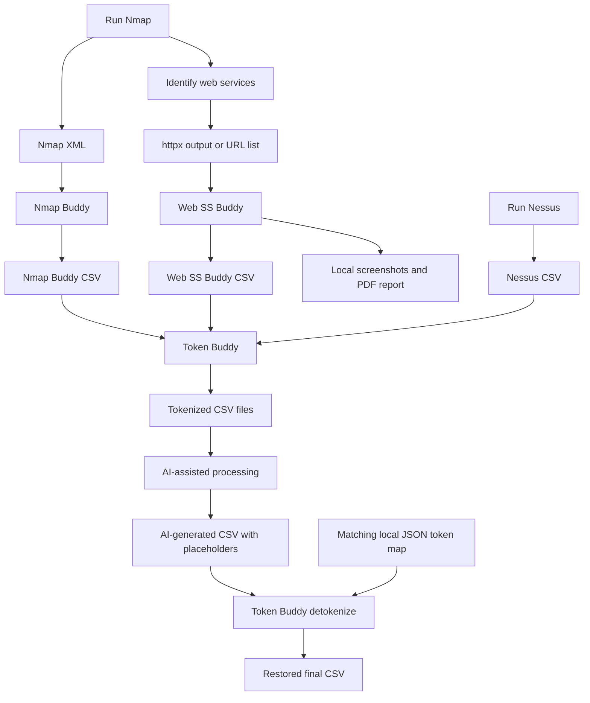

# Token Buddy

Python script that reversibly tokenizes identifiers in CSV files before sending them to an AI platform for processing.

Token Buddy replaces selected values with consistent placeholders and stores the originals in a local JSON token map so they can be restored later.

```text
10.10.10.5                -> <<IP_0001>>
2001:db8::1               -> <<IPV6_0001>>
10.10.10.0/24             -> <<CIDR_0001>>
web01.client.example.com  -> <<FQDN_0001>>
Internal Project Falcon   -> <<KEYWORD_0001>>
```

Vibe coded this to help with preparing vulnerability-scan CSV output for AI-assisted processing without exposing IP addresses, FQDNs, IPv6 addresses, CIDRs, or specific keywords that should remain local. The tokenized CSV can be used for tasks such as report writing, finding summaries, grouping findings, or CSV clean-up, then restored with the same local token map.

## Enumeration Workflow

1. Run Nmap and Nessus within an authorised scope.
2. Use [Nmap Buddy](https://github.com/0xdbyx/nmap_buddy) to convert Nmap XML output into a CSV.
3. Use [Web SS Buddy](https://github.com/0xdbyx/web_ss_buddy) to generate screenshots, a PDF report, and a CSV summary for discovered web services.
4. Use Token Buddy to tokenize the Nessus CSV, Nmap Buddy CSV, and Web SS Buddy CSV.
5. Send only the tokenized CSV files to an AI platform.
6. Use Token Buddy to detokenize the AI-generated CSV with the matching token map.



## Features

* Creates reversible placeholders with a local JSON token map
* Tokenizes IPv4, IPv6, CIDR, FQDN, and custom keywords
* Supports case-insensitive custom keyword matching
* Reuses the same placeholder for the same value when using the same map
* Leaves the Tenable `See Also` column unchanged

## What Gets Tokenized

| Input                           | Example                                            | Output                                   |
| ------------------------------- | -------------------------------------------------- | ---------------------------------------- |
| Whole-cell IPv4                 | `10.10.10.5`                                       | `<<IP_0001>>`                            |
| Whole-cell IPv6                 | `2001:db8::1`                                      | `<<IPV6_0001>>`                          |
| Whole-cell CIDR                 | `10.10.10.0/24`                                    | `<<CIDR_0001>>`                          |
| Whole-cell FQDN                 | `web01.client.example.com`                         | `<<FQDN_0001>>`                          |
| IPv4 inside text                | `Host is 10.10.10.5`                               | `Host is <<IP_0001>>`                    |
| CIDR inside text                | `Subnet: 10.10.10.0/24`                            | `Subnet: <<CIDR_0001>>`                  |
| URL hostname                    | `http://d20.example.com:81/`                       | `http://<<FQDN_0001>>:81/`               |
| DNS resolution wording          | `10.10.10.5 resolves as web01.client.example.com.` | `<<IP_0001>> resolves as <<FQDN_0001>>.` |
| Labelled identifier             | `FQDN: web01.client.example.com`                   | `FQDN: <<FQDN_0001>>`                    |
| Keyword from `redact_terms.txt` | `Internal Project Falcon`                          | `<<KEYWORD_0001>>`                       |

## Usage

Show help:

```bash
python token_buddy.py --help
```

### Tokenize a CSV

Only `--input` is required:

```bash
python token_buddy.py tokenize --input nessus.csv
```

This creates:

```text
nessus_sanitised.csv
nessus_token_map.json
```

Use verbose mode for safe aggregate counts:

```bash
python token_buddy.py tokenize --input nessus.csv --verbose
```

Use custom output and map names when needed:

```bash
python token_buddy.py tokenize \
  --input nessus.csv \
  --output nessus_sanitised.csv \
  --map assessment_token_map.json
```

## Custom Keywords

Create a file called `redact_terms.txt` in the same folder as the script.

Example:

```text
# One literal term per line
Client Name
Internal Project Falcon
Confidential Platform
```

Keyword matching is case-insensitive:

```text
Client Name
CLIENT NAME
client name
```

All match a `<<KEYWORD_####>>` placeholder.

Use another keyword-file path with:

```bash
python token_buddy.py tokenize \
  --input nessus.csv \
  --terms-file redact_terms.txt
```

## Reusing a Token Map

Reusing the same token map and expanding it:

```bash
python token_buddy.py tokenize \
  --input nessus.csv \
  --map assessment_token_map.json \
  --reuse-map
```

This keeps identifiers consistent across related files:

```text
10.10.10.5 in Nessus CSV     -> <<IP_0001>>
10.10.10.5 in Nmap Buddy CSV -> <<IP_0001>>
```

## Detokenize an AI-Generated CSV

After AI processing is complete, restore the original values with the same map:

```bash
python token_buddy.py detokenize \
  --input ai_output.csv \
  --map assessment_token_map.json
```

This creates:

```text
ai_output_restored.csv
```

Use `--output` to choose a different filename:

```bash
python token_buddy.py detokenize \
  --input ai_output.csv \
  --output final_report_data.csv \
  --map assessment_token_map.json
```

## Validate a Token Map

Check that the map is readable and internally consistent:

```bash
python token_buddy.py validate-map --map assessment_token_map.json
```

This does not modify the map or display original values.

## Tokenize Example

Input CSV:

```csv
Host,Plugin Output,See Also
web01.client.example.com,10.10.10.5 resolves as web01.client.example.com.,https://www.tenable.com/plugins/nessus/12345
```

Tokenized CSV:

```csv
Host,Plugin Output,See Also
<<FQDN_0001>>,<<IP_0001>> resolves as <<FQDN_0001>>.,https://www.tenable.com/plugins/nessus/12345
```

## Important Notes

* Do not upload or share the JSON token map. It contains the original values.
* The `See Also` column remains unchanged so Tenable reference URLs are preserved.
* Unknown placeholders are left unchanged during detokenization.
* A whole-cell value that looks structurally like an FQDN, such as `archive.tar.gz`, may be tokenized as an FQDN.
